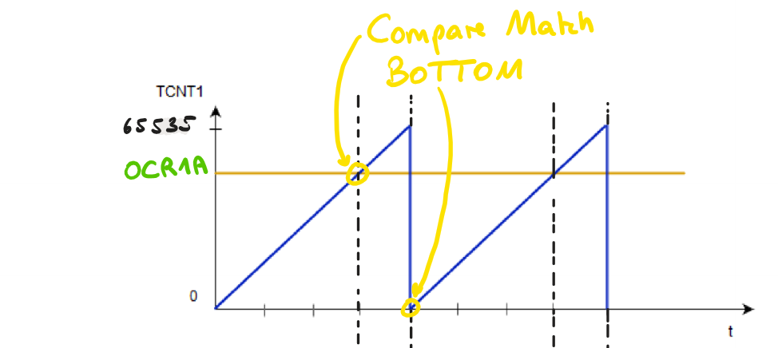
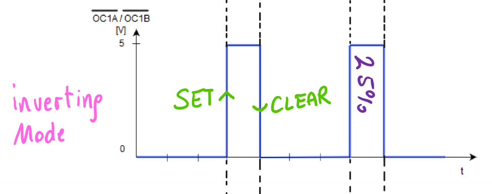
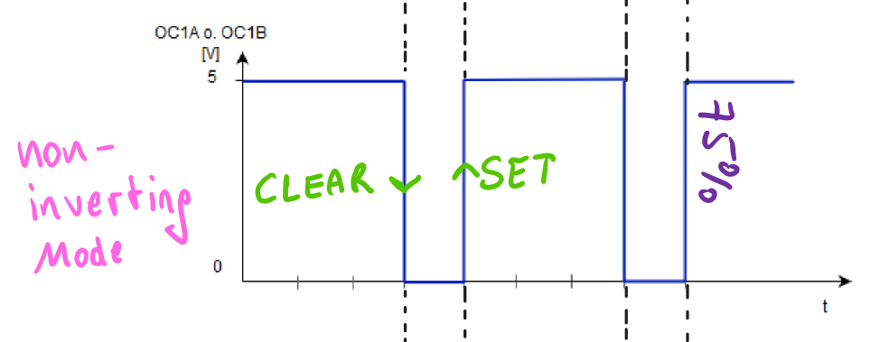

Der Timer ist ein sehr nützliches Instrument in der hardwarenahen Programmierung und eignet sich besonders gut für zeitbasierte Vorgänge, wie zum Beispiel:

-   Delay (Programmverzögerung) um bestimmte Anzahl an Sekunden
-   regelmäßig ADC triggern
-   DC-Motor drehzahlgesteuert zu betreiben

## Theorie

Der ATmega 328p hat 3 verschiedene Timer:

-   TC0: 8-bit
-   TC1: 16-bit
-   TC2: 8-bit; async

:::note
Ersetzen Sie im gesamten Artikel das `n` immer mit der jeweiligen Nummer des Timers, welchen Sie gerade verwenden (TC0: n = 0; TC1: n = 1; ...). Im ATmega328P Datenblatt, ist TC0 [Kapitel 14](https://ww1.microchip.com/downloads/en/DeviceDoc/Atmel-7810-Automotive-Microcontrollers-ATmega328P_Datasheet.pdf#page=74), TC1 [Kapitel 15](https://ww1.microchip.com/downloads/en/DeviceDoc/Atmel-7810-Automotive-Microcontrollers-ATmega328P_Datasheet.pdf#page=89) und TC2 [Kapitel 17](https://ww1.microchip.com/downloads/en/DeviceDoc/Atmel-7810-Automotive-Microcontrollers-ATmega328P_Datasheet.pdf#page=116).
:::

Jeder Timer verfügt über ein eigenes Zählregister `TCNTn`, welches einmal pro Systemtakt hochzählt. Wenn das Zählregister den `TOP`-Wert bzw. den `OCRnx`-Wert ([CTC Mode](#ctc---clear-timer-on-compare-match)) erreicht hat, passiert ein Überlauf. Das ist der Fachausdrück für den Prozess, bei welchem `TCNTn` wieder auf den `BOTTOM`-Wert gesetzt wird.

:::tip[Aha!]
Der 16-bit Timer verfügt hierbei über einen größeren Speicherplatz für das Zählregister, nämlich **zwei** Bytes im Gegensatz zu nur einem Byte, weshalb er seltener überläuft, weil `TCNT1` erst bis 65536 zählen muss, während `TCNT0` und `TCNT2` nur bis 256 laufen.
:::

Der Prozess des Überlaufs ist periodisch und wird hier grafisch dargestellt:


:::tip[Formular]
Um sich die Zeitspanne $\Delta t$ auszurechnen, welche beschreibt, in welchen Zeitabständen der jeweilige Timer zum Überlauf kommt, gibt es folgende Formel:

$$
\frac {2^{Bit\;des\;Timers}} {Hz\;des\;Microcontrollers} = {\Delta t\;in\;Sekunden}
$$

:::

### Prescaler

Der Prescaler verlangsamt den Zähltakt. Auf Hardware-Ebene ist der Prescaler nämlich ein Bauteil vorm Timer, welcher den Systemtakt als Input bekommt und den manipulierten neuen Takt an den Timer weitergibt. Standardmäßig ist der Prescaler nicht gesetzt, was bedeutet, dass der Timer gar keinen Takt bekommt und somit gestoppt ist.

| Prescaler | neuer Takt $f$ | neue Periodendauer $T$ | $\Delta t$ 8-bit / 256 | $\Delta t$ 16-bit / 65536 |
| --------: | -------------: | ---------------------: | ---------------------: | ------------------------: |
|         1 |          16MHz |            0.0000625ms |                0.016ms |                   4.096ms |
|         8 |           2MHz |               0.0005ms |               0.1275ms |                   32.76ms |
|        64 |         250kHz |                0.004ms |                 1.02ms |                  262.14ms |
|       256 |        62.5kHz |                0.016ms |                 4.08ms |                  1048.5ms |
|      1024 |      15.625kHz |                0.064ms |                16.32ms |                 4194.24ms |

:::tip[Erinnerung]
Die Periodendauer $T$ ist gleich $\frac1f$, wobei $f$ die Frequenz in `Hz` ist. Sprich, je größer der Takt, desto kleiner die Periodendauer.

$$
T = \frac1f \Leftrightarrow f = \frac1T
$$

:::

### Modes of Operation

Dabei hat jeder Timer 3 verschiedene Modi, welche in der Tabelle kurz erklärt werden:

| Normal Mode                                                                                                                                                                                                                                                                                                                                          | CTC Mode                                                                                                                                                                                                                                                                                                              | PWM Mode                                                                                                                                                                                                           |
| ---------------------------------------------------------------------------------------------------------------------------------------------------------------------------------------------------------------------------------------------------------------------------------------------------------------------------------------------------- | --------------------------------------------------------------------------------------------------------------------------------------------------------------------------------------------------------------------------------------------------------------------------------------------------------------------- | ------------------------------------------------------------------------------------------------------------------------------------------------------------------------------------------------------------------ |
| Im normalen Modus zählt der Timer von `BOTTOM` bis `TOP` und wird bei `TOP` wieder auf `BOTTOM` gesetzt. Es gibt die Möglichkeit den Timer mit einem bestimmten Wert vorzuladen - also quasi den `BOTTOM`-Wert zu erhöhen -, indem man einfach `TCNTn` immer direkt nach dem Überlauf setzt, weshalb man die Zeitspanne bis zum Überlauf verringert. | Bei der Clear Timer on Compare Match setzt man anfangs einmal den `OCRnA`- bzw. den `OCRnB`-Wert. Erreicht der Timer (also `TCNTn`) diesen Wert, wird er gecleart, was bedeutet, dass `TCNTn` wieder auf 0 gesetzt wird. Die Timer unterstützen dabei zwei unabhängige Output Compare Register (`OCRnA` und `OCRnB`). | Mithilfe der Pulse Width Modulation kann man die Spannung auf einem bestimmten PIN variable verändern. Somit lässt sich z.B. ein DC-Motor steuern, welcher sich umso schneller dreht, je mehr Spannung er bekommt. |

#### Normal Mode

Um einen bestimmten Programmcode in gewüschten Zeitabständen auszulösen, können wir also nun einen Timer verwenden, welcher konstant hochzählt und überläuft. Da die Zeitspanne bis zum Überlauf allerdings nicht immer exakt der gewünschten Zeitspanne entsprechen wird, müssen wir den `BOTTOM`-Wert / Vorladewert so verändern (also erhöhen), dass die zeitliche Differenz zwischen dem Vorladewert und dem `TOP`-Wert genau der gewünschten Zeitspanne entspricht. Wie man dies programmtechnisch umsetzt, wird unten beim [Code](#tcntn-vorladen) erklärt. Um Ihnen die schwierigen Berechnungen zu ersparen, gibt es hier eine einfache Formel zur Berechnung des Vorladewertes:

$$
Vorladewert = 2^{Bit\;des\;Timers} - {gewünschte\;Zeitspanne\;in\;Sekunden} * \frac {Hz\;des\;Microcontrollers} {Prescaler}
$$

:::note[Beachte!]
Damit die obrige Formel keine irrsinnigen Erbegnisse ausspuckt, müssen folgende Bedingungen erfüllen sein:

$$
Prescaler = \{ 1, 8, 64, 256, 1024 \}
$$

$$
0 \le gewünschte\;Zeitspanne \le \frac {1} {Hz\;des\;Microcontrollers} * 2^{Bit\;des\;Timers} * Prescaler
$$

Wenn man die Definitionsmengen nämlich nicht erfüllt, würden Werte für den Vorladewert $\gt$ `TOP`-Wert herauskommen.
:::

Zur Visualisierung, was wir eigentlich gerade gemacht haben, eignet sich dieses Bild:


#### CTC - Clear Timer on Compare Match

Der Clear Timer on Compare Match Mode erleichtert uns die exakte regelmäßige Ausführung eines Programmcodes. Man setzt anfangs einmalig den `OCRnx`-Wert (Output Compare Register) als Obergrenze. Man kann sich das so vorstellen, als würde man den `TOP`-Wert senken. Somit ist der CTC Mode das Gegenteil des Vorladens, erfüllt allerdings den gleichen Zweck.

Die Formel zur Berechnung des `Output Compare Register`-Wertes ist ziemlich ähnlich. Beachten Sie dabei wieder die gleichen Definitionsmengen wie bei [obriger Formel](#normal-mode)!

$$
Output\;Compare\;Register =  \frac {gewünschte\;Zeitspanne\;in\;Sekunden} {\frac {1} {Hz\;des\;Microcontrollers} * Prescaler}
$$

#### PWM - Pulse Width Modulation

Mithilfe des PWM Modes kann man an bestimmten PINs eine bestimmte Spannung zwischen 0V und 5V anlegen. Durch ständiges, in bestimmten Intervallen auftretendes Ein- und Ausschalten der Spannung, stellt sich diese nach kurzer Zeit automatisch auf den Mittelwert der zeitlich auftretenden Spannungen ein.

Diese Vorgang passiert in Realität so schnell, dass man das ständigen Ein- und Ausschalten nicht mitbekommt. Hier ist der Prozess dargestellt:


Der PWM Mode ermöglicht uns also das exakte Einstellen der Spannung bei Laufzeit.

##### Duty Cycle

Eventuell ist Ihnen aufgefalls, dass im obrigen Bild $50\%$ in den Bereichen steht, wo die Spannung _high_ ist. Genau dieses Zeitintervall in Prozent ist der sogenannte **Duty Cycle** und die Berechnung für diesen ist hier zu sehen:

$$
Duty\;Cycle = \frac {T_{on}} {T_{on} + T_{off}} * 100\%
$$

:::note
$T$ ist die Periodendauer, also das Zeitintervall, in welchem die Spannung entweder _high_ oder _low_ ist.
:::

Konfigureren kann man den Duty Cycle mittels dem `OCRnx` Register. Dieses bestimmt - genau wie beim CTC Mode - den Vergleichswert (`Output Compare Register`).



---

Der PWM Mode kann invertiert oder nicht invertiert betrieben werden:

##### Invertierter Modus

Beim invertierten Modus wird beim Erreichen des Vergleichswertes (`TCNTn` $=$ `OCRnx`) die Spannung auf _high_ gesetzt und beim Überlauf auf _low_.



##### Nicht Invertierter Modus

Beim nicht invertierten Modus ist es genau umgekehrt. Beim Erreichen des Vergleichswertes (`TCNTn` $=$ `OCRnx`) wird die Spannung auf _low_ gesetzt und beim Überlauf auf _high_.



### Interrupts

## Code

Übersichtliche Tabelle für die wichtigsten Konfigurationen (alle Konfiguration finden Sie hier: [TC0: Table 14-8](https://ww1.microchip.com/downloads/en/DeviceDoc/Atmel-7810-Automotive-Microcontrollers-ATmega328P_Datasheet.pdf#page=86), [TC1: Table 15-5](https://ww1.microchip.com/downloads/en/DeviceDoc/Atmel-7810-Automotive-Microcontrollers-ATmega328P_Datasheet.pdf#page=109), [TC2: Table 17-8](https://ww1.microchip.com/downloads/en/DeviceDoc/Atmel-7810-Automotive-Microcontrollers-ATmega328P_Datasheet.pdf#page=130)):

|     | Normal Mode                                                     | CTC Mode                                                        | Fast<br/>PWM Mode                                               | Phase Corret<br/>PWM Mode                                       |
| --- | --------------------------------------------------------------- | --------------------------------------------------------------- | --------------------------------------------------------------- | --------------------------------------------------------------- |
| TC0 | `WGM00` == 0<br/>`WGM01` == 0<br/>`WGM02` == 0                  | `WGM00` == 0<br/>`WGM01` == 1<br/>`WGM02` == 0                  | `WGM00` == 1<br/>`WGM01` == 1<br/>`WGM02` == 0                  | `WGM00` == 1<br/>`WGM01` == 0<br/>`WGM02` == 0                  |
| TC1 | `WGM10` == 0<br/>`WGM11` == 0<br/>`WGM12` == 0<br/>`WGM13` == 0 | `WGM10` == 0<br/>`WGM11` == 0<br/>`WGM12` == 1<br/>`WGM13` == 0 | `WGM10` == 1<br/>`WGM11` == 0<br/>`WGM12` == 1<br/>`WGM13` == 0 | `WGM10` == 1<br/>`WGM11` == 0<br/>`WGM12` == 0<br/>`WGM13` == 0 |
| TC2 | `WGM20` == 0<br/>`WGM21` == 0<br/>`WGM22` == 0                  | `WGM20` == 0<br/>`WGM21` == 1<br/>`WGM22` == 0                  | `WGM20` == 1<br/>`WGM21` == 1<br/>`WGM22` == 0                  | `WGM20` == 1<br/>`WGM21` == 0<br/>`WGM22` == 0                  |

### Normal Mode

Für den normalen Modus beim Timer können folgende Konfigurationen getroffen werden:

-   `WGMn0`, `WGMn1` und `WGMn2` (und `WGM13`) auf 0 setzen (siehe [Table 14-8](https://ww1.microchip.com/downloads/en/DeviceDoc/Atmel-7810-Automotive-Microcontrollers-ATmega328P_Datasheet.pdf#page=86), [Table 15-5](https://ww1.microchip.com/downloads/en/DeviceDoc/Atmel-7810-Automotive-Microcontrollers-ATmega328P_Datasheet.pdf#page=109) oder [Table 17-8](https://ww1.microchip.com/downloads/en/DeviceDoc/Atmel-7810-Automotive-Microcontrollers-ATmega328P_Datasheet.pdf#page=130))

    ```c
    // Timer Modus auf Normal Mode setzen
    TCCRnA &= ~((1<<WGMn0) | (1<<WGMn1));
    TCCRnB &= ~((1<<WGMn2));
    ```

-   `CSn0`, `CSn1` und `CSn2` einstellen (siehe [Table 14-9](https://ww1.microchip.com/downloads/en/DeviceDoc/Atmel-7810-Automotive-Microcontrollers-ATmega328P_Datasheet.pdf#page=87), [Table 15-6](https://ww1.microchip.com/downloads/en/DeviceDoc/Atmel-7810-Automotive-Microcontrollers-ATmega328P_Datasheet.pdf#page=110) oder [Table 17-9](https://ww1.microchip.com/downloads/en/DeviceDoc/Atmel-7810-Automotive-Microcontrollers-ATmega328P_Datasheet.pdf#page=131))

    ```c
    // Prescaler einstellen - Beispiel 1024
    TCCRnB |= (1<<CSn0) | (1<<CSn2);
    TCCRnB &= ~(1<<CSn1);
    ```

    Nutzen Sie [diese](#prescaler) Tabelle, um herauszufinden, welcher Prescaler Wert in Ihrem Program am meisten Sinn macht.

#### `TCNTn` vorladen

:::tip[Aufgabe]
Erstellen Sie ein Programm, bei welchem eine ISR alle **vier Millisekunden** ausgeführt wird! Nutzen Sie dafür den Timer im Normal Mode!
:::

Um diese Aufgabe zu lösen, verwenden wir die [Formel](#normal-mode), um uns den Vorladewert von $1536$ auszurechnen.

```c
#define F_CPU 16000000

#include <avr/io.h>

int main(void)
{
	// Timer Modus auf Normal setzen (optional)
    TCCR1A &= ~((1<<WGM10) | (1<<WGM11));
    TCCR1B &= ~((1<<WGM12) | (1<<WGM13));

    // Zählregister vorladen
    TCNT1 = 1536;

    sei();

	while (1);
}

// ISR wird jeden Überlauf getriggert - alle 4ms in diesem Fall
ISR(TIMER1_OVF_vect) {
    // Code

    // Zählregister vorladen
    TCNT1 = 1536;
}
```

### CTC - Clear Timer on Compare Match

Für den CTC Modus beim Timer müssen/können folgende Konfigurationen getroffen werden:

-   `WGMnx` richtig setzen (TC0 / TC2: `WGMn1`; TC1: `WGM12` (und `WGM13`))  
    (siehe [Table 14-8](https://ww1.microchip.com/downloads/en/DeviceDoc/Atmel-7810-Automotive-Microcontrollers-ATmega328P_Datasheet.pdf#page=86), [Table 15-5](https://ww1.microchip.com/downloads/en/DeviceDoc/Atmel-7810-Automotive-Microcontrollers-ATmega328P_Datasheet.pdf#page=109) oder [Table 17-8](https://ww1.microchip.com/downloads/en/DeviceDoc/Atmel-7810-Automotive-Microcontrollers-ATmega328P_Datasheet.pdf#page=130))

-   `OCIEnx` auf 1 setzen (siehe [14.9.6](https://ww1.microchip.com/downloads/en/DeviceDoc/Atmel-7810-Automotive-Microcontrollers-ATmega328P_Datasheet.pdf#page=88), [15.11.8](https://ww1.microchip.com/downloads/en/DeviceDoc/Atmel-7810-Automotive-Microcontrollers-ATmega328P_Datasheet.pdf#page=112) oder [17.11.6](https://ww1.microchip.com/downloads/en/DeviceDoc/Atmel-7810-Automotive-Microcontrollers-ATmega328P_Datasheet.pdf#page=132))

    ```c
    // Interrupts aktivieren - Beispiel Compare Match A
    TIMSKn |= (1<<OCIEnA);
    ```

-   `CSn0`, `CSn1` und `CSn2` einstellen (siehe [Table 14-9](https://ww1.microchip.com/downloads/en/DeviceDoc/Atmel-7810-Automotive-Microcontrollers-ATmega328P_Datasheet.pdf#page=87), [Table 15-6](https://ww1.microchip.com/downloads/en/DeviceDoc/Atmel-7810-Automotive-Microcontrollers-ATmega328P_Datasheet.pdf#page=110) oder [Table 17-9](https://ww1.microchip.com/downloads/en/DeviceDoc/Atmel-7810-Automotive-Microcontrollers-ATmega328P_Datasheet.pdf#page=131))

    ```c
    // Prescaler einstellen - Beispiel 256
    TCCRnB |= (1<<CSn2);
    TCCRnB &= ~((1<<CSn0) | (1<<CSn1));
    ```

    Nutzen Sie [diese](#prescaler) Tabelle, um herauszufinden, welcher Prescaler Wert in Ihrem Program am meisten Sinn macht.

:::tip[Aufgabe]
Erstellen Sie ein Programm, bei welchem eine ISR alle **vier Millisekunden** ausgeführt wird! Nutzen Sie dafür den Timer im CTC Mode!
:::

Um diese Aufgabe zu lösen, verwenden wir die [Formel](#ctc---clear-timer-on-compare-match), um uns den Vorladewert von $64000$ auszurechnen.

```c
#define F_CPU 16000000

#include <avr/io.h>

int main(void)
{
	// Timer Modus auf CTC setzen
    TCCR1A &= ~((1<<WGM10) | (1<<WGM11));
    TCCR1B |= (1<<WGM12);
    TCCR1B &= ~(1<<WGM13);

    // Output Compare Register richtig einstellen
    OCR1A = 64000;

    // Output Compare Register Interrupt aktivieren
    TIMSK1 |= (1<<OCIE1A);

    sei();

	while (1);
}

// ISR wird bei jedem Compare Match getriggert - alle 4ms in diesem Fall
ISR(TIMER1_COMPA_vect) {
    // Code
}
```

### PWM - Puls Width Modulation

Für den PWM Modus beim Timer müssen/können folgende Konfigurationen getroffen werden:

-   `WGMnx` richtig setzen
    (siehe [Table 14-8](https://ww1.microchip.com/downloads/en/DeviceDoc/Atmel-7810-Automotive-Microcontrollers-ATmega328P_Datasheet.pdf#page=86), [Table 15-5](https://ww1.microchip.com/downloads/en/DeviceDoc/Atmel-7810-Automotive-Microcontrollers-ATmega328P_Datasheet.pdf#page=109) oder [Table 17-8](https://ww1.microchip.com/downloads/en/DeviceDoc/Atmel-7810-Automotive-Microcontrollers-ATmega328P_Datasheet.pdf#page=130))

-   invertierenden / nicht-invertierenden Modus einstellen

    -   `COMnA0` und `COMnA1` (siehe [Table 14-3 und 14-4](https://ww1.microchip.com/downloads/en/DeviceDoc/Atmel-7810-Automotive-Microcontrollers-ATmega328P_Datasheet.pdf#page=84), [Table 15-3 und 15-4](https://ww1.microchip.com/downloads/en/DeviceDoc/Atmel-7810-Automotive-Microcontrollers-ATmega328P_Datasheet.pdf#page=108) oder [Table 17-3 und 17-4](https://ww1.microchip.com/downloads/en/DeviceDoc/Atmel-7810-Automotive-Microcontrollers-ATmega328P_Datasheet.pdf#page=128))

    -   `COMnB0` und `COMnB1` (siehe [Table 14-6 und 14-7](https://ww1.microchip.com/downloads/en/DeviceDoc/Atmel-7810-Automotive-Microcontrollers-ATmega328P_Datasheet.pdf#page=85), [Table 15-3 und 15-4](https://ww1.microchip.com/downloads/en/DeviceDoc/Atmel-7810-Automotive-Microcontrollers-ATmega328P_Datasheet.pdf#page=108) oder [Table 17-6 und 17-7](https://ww1.microchip.com/downloads/en/DeviceDoc/Atmel-7810-Automotive-Microcontrollers-ATmega328P_Datasheet.pdf#page=129))

-   `CSn0`, `CSn1` und `CSn2` einstellen (siehe [Table 14-9](https://ww1.microchip.com/downloads/en/DeviceDoc/Atmel-7810-Automotive-Microcontrollers-ATmega328P_Datasheet.pdf#page=87), [Table 15-6](https://ww1.microchip.com/downloads/en/DeviceDoc/Atmel-7810-Automotive-Microcontrollers-ATmega328P_Datasheet.pdf#page=110) oder [Table 17-9](https://ww1.microchip.com/downloads/en/DeviceDoc/Atmel-7810-Automotive-Microcontrollers-ATmega328P_Datasheet.pdf#page=131))

    ```c
    // Prescaler einstellen - Beispiel 64
    TCCRnB |= (1<<CSn0) | (1<<CSn1);
    TCCRnB &= ~(1<<CSn2);
    ```

    Nutzen Sie [diese](#prescaler) Tabelle, um herauszufinden, welcher Prescaler Wert in Ihrem Program am meisten Sinn macht.

:::tip[Aufgabe]
Erstellen Sie ein Programm, bei welchem eine ISR alle **vier Millisekunden** ausgeführt wird! Nutzen Sie dafür den Timer im CTC Mode!
:::

Um diese Aufgabe zu lösen, verwenden wir die [Formel](#ctc---clear-timer-on-compare-match), um uns den Vorladewert von $64000$ auszurechnen.

```c
#define F_CPU 16000000

#include <avr/io.h>
#include <util/delay.h>
#include <avr/interrupt.h>


int main(void)
{
	// PB1 als Ausgang konfigurieren
	DDRB |= (1<<DDB1);

	// WGM10 und WGM12: Fast PWM; 8-bit aktivieren (MAX -> 255)
	TCCR1A |= (1<<WGM10);
	TCCR1B |= (1<<WGM12);

	// CS12: 256er Prescaler setzen => PWM mit 244,1 Hz
	TCCR1B |= (1<<CS12);

	// non-inverting Mode einstellen
	TCCR1A |= (1<<COM1A1);

	// REFS0: Aufgrund der Beschaltung des ADCs.
	// A3: Analoges Signal an PC3 => MUX0 | MUX1
	ADMUX |= (1<<REFS0) | (1<<MUX0) | (1<<MUX1);

	// ADEN => Enables ADC
	// ADPSx => Division Factor to get between 50kHz and 200kHz with our 60MHz Elegoo.
	ADCSRA |= (1<<ADEN) | (1<<ADPS0) | (1<<ADPS1) | (1<<ADPS2);

	ADCSRA |= (1<<ADIE);

	// ADSC => Start Conversion
	ADCSRA |= (1<<ADSC);

	sei();

    /* Replace with your application code */
    while (1)
    {
		//OCR1A = 65;				// Pulsweite DC von ca. 25%
		//_delay_ms(2000);
		//OCR1A = 123;			// Pulsweite DC von ca. 50%
		//_delay_ms(2000);
		//OCR1A = 255;			// Pulsweite DC von ca. 100%
		//_delay_ms(2000);
    }
}

ISR(ADC_vect) {
	OCR1A = ADCW / (1023 / 255);

	// ADSC => Start Conversion
	ADCSRA |= (1<<ADSC);
}
```

### Interrupts

Timer Counter n Überlauf:

```c
ISR(TIMERn_OVF_vect) {

}
```

Timer Counter n Compare Match x:

```c
// CTC Mode
ISR(TIMERn_COMPx_vect) {

}
```
