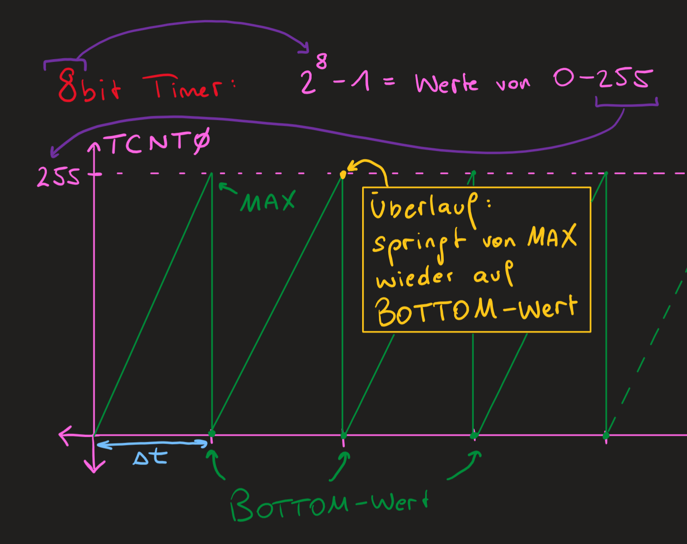
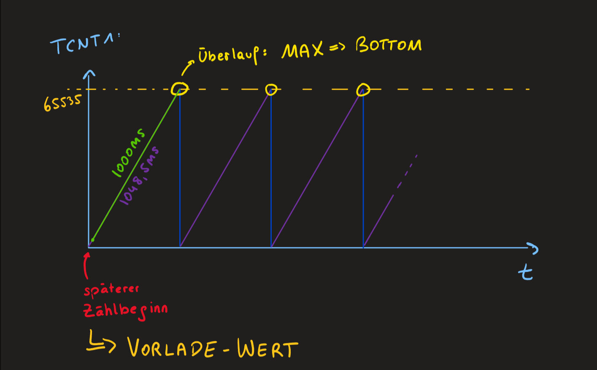

Der Timer ist ein sehr nützliches Instrument in der hardwarenahen Programmierung und eignet sich besonders gut für zeitbasierte Vorgänge, wie zum Beispiel:

-   Delay (Programmverzögerung) um bestimmte Anzahl an Sekunden
-   regelmäßig ADC triggern
-   DC-Motor drehzahlgesteuert zu betreiben

## Theorie

Der ATmega 328p hat 3 verschiedene Timer:

-   TC0: 8-bit
-   TC1: 16-bit
-   TC2: 8-bit; async

:::note
Ersetzen Sie im gesamten Artikel das `n` immer mit der jeweiligen Nummer des Timers, welchen Sie gerade verwenden (TC0: n = 0; TC1: n = 1; ...). Im ATmega328P Datenblatt, ist TC0 [Kapitel 14](https://ww1.microchip.com/downloads/en/DeviceDoc/Atmel-7810-Automotive-Microcontrollers-ATmega328P_Datasheet.pdf#page=74), TC1 [Kapitel 15](https://ww1.microchip.com/downloads/en/DeviceDoc/Atmel-7810-Automotive-Microcontrollers-ATmega328P_Datasheet.pdf#page=89) und TC2 [Kapitel 17](https://ww1.microchip.com/downloads/en/DeviceDoc/Atmel-7810-Automotive-Microcontrollers-ATmega328P_Datasheet.pdf#page=116).
:::

Jeder Timer verfügt über ein eigenes Zählregister `TCNTn`, welches einmal pro Systemtakt hochzählt. Wenn das Zählregister den `TOP`-Wert bzw. den `OCRnx`-Wert ([CTC Mode](#ctc---clear-timer-on-compare-match)) erreicht hat, passiert ein Überlauf. Das ist der Fachausdrück für den Prozess, bei welchem `TCNTn` wieder auf den `BOTTOM`-Wert gesetzt wird.

:::tip[Aha!]
Der 16-bit Timer verfügt hierbei über einen größeren Speicherplatz für das Zählregister, nämlich **zwei** Bytes im Gegensatz zu nur einem Byte, weshalb er seltener überläuft, weil `TCNT1` erst bis 65536 zählen muss, während `TCNT0` und `TCNT2` nur bis 256 laufen.
:::

Der Prozess des Überlaufs ist periodisch und wird hier grafisch dargestellt:



:::tip[Formular]
Um sich die Zeitspanne $\Delta t$ auszurechnen, welche beschreibt, in welchen Zeitabständen der jeweilige Timer zum Überlauf kommt, gibt es folgende Formel:

$$
\frac {2^{Bit\;des\;Timers}} {MHz\;des\;Microcontrollers} = {\Delta t\;in\;Sekunden}
$$

:::

### Prescaler

Der Prescaler verlangsamt den Zähltakt. Auf Hardware-Ebene ist der Prescaler nämlich ein Bauteil vorm Timer, welcher den Systemtakt als Input bekommt und den manipulierten neuen Takt an den Timer weitergibt. Standardmäßig ist der Prescaler nicht gesetzt, was bedeutet, dass der Timer gar keinen Takt bekommt und somit gestoppt ist.

| Prescaler | neuer Takt $f$ | neue Periodendauer $T$ | $\Delta t$ 8-bit / 256 | $\Delta t$ 16-bit / 65536 |
| --------: | -------------: | ---------------------: | ---------------------: | ------------------------: |
|         1 |          16MHz |            0.0000625ms |                0.016ms |                   4.096ms |
|         8 |           2MHz |               0.0005ms |               0.1275ms |                   32.76ms |
|        64 |         250kHz |                0.004ms |                 1.02ms |                  262.14ms |
|       256 |        62.5kHz |                0.016ms |                 4.08ms |                  1048.5ms |
|      1024 |      15.625kHz |                0.064ms |                16.32ms |                 4194.24ms |

:::tip[Erinnerung]
Die Periodendauer $T$ ist gleich $\frac1f$, wobei $f$ die Frequenz in `Hz` ist. Sprich, je größer der Takt, desto kleiner die Periodendauer.

$$
T = \frac1f \Leftrightarrow f = \frac1T
$$

:::

### Modes of Operation

Dabei hat jeder Timer 3 verschiedene Modi, welche in der Tabelle kurz erklärt werden:

| Normal Mode                                                                                                                                                                                                                                                                                                                                          | CTC Mode                                                                                                                                                                                                                                                                                                              | PWM Mode                                                                                                                                                                                                           |
| ---------------------------------------------------------------------------------------------------------------------------------------------------------------------------------------------------------------------------------------------------------------------------------------------------------------------------------------------------- | --------------------------------------------------------------------------------------------------------------------------------------------------------------------------------------------------------------------------------------------------------------------------------------------------------------------- | ------------------------------------------------------------------------------------------------------------------------------------------------------------------------------------------------------------------ |
| Im normalen Modus zählt der Timer von `BOTTOM` bis `TOP` und wird bei `TOP` wieder auf `BOTTOM` gesetzt. Es gibt die Möglichkeit den Timer mit einem bestimmten Wert vorzuladen - also quasi den `BOTTOM`-Wert zu erhöhen -, indem man einfach `TCNTn` immer direkt nach dem Überlauf setzt, weshalb man die Zeitspanne bis zum Überlauf verringert. | Bei der Clear Timer on Compare Match setzt man anfangs einmal den `OCRnA`- bzw. den `OCRnB`-Wert. Erreicht der Timer (also `TCNTn`) diesen Wert, wird er gecleart, was bedeutet, dass `TCNTn` wieder auf 0 gesetzt wird. Die Timer unterstützen dabei zwei unabhängige Output Compare Register (`OCRnA` und `OCRnB`). | Mithilfe der Pulse Width Modulation kann man die Spannung auf einem bestimmten PIN variable verändern. Somit lässt sich z.B. ein DC-Motor steuern, welcher sich umso schneller dreht, je mehr Spannung er bekommt. |

#### Normal Mode

Um einen bestimmten Programmcode in gewüschten Zeitabständen auszulösen, können wir also nun einen Timer verwenden, welcher konstant hochzählt und überläuft. Da die Zeitspanne bis zum Überlauf allerdings nicht immer exakt der gewünschten Zeitspanne entsprechen wird, müssen wir den `BOTTOM`-Wert / Vorladewert so verändern (also erhöhen), dass die zeitliche Differenz zwischen dem Vorladewert und dem `TOP`-Wert genau der gewünschten Zeitspanne entspricht. Wie man dies programmtechnisch umsetzt, wird unten beim [Code](#tcntn-vorladen) erklärt. Um Ihnen die schwierigen Berechnungen zu ersparen, gibt es hier eine einfache Formel zur Berechnung des Vorladewertes:

$$
Vorladewert = 2^{Bit\;des\;Timers} - \frac {gewünschte\;Zeitspanne\;in\;Sekunden} {\frac {1} {MHz\;des\;Microcontrollers} * Prescaler}
$$

:::note[Beachte!]
Damit die obrige Formel keine irrsinnigen Erbegnisse ausspuckt, müssen folgende Bedingungen erfüllen sein:

$$
Prescaler = \{ 1, 8, 64, 256, 1024 \}
$$

$$
0 \le gewünschte\;Zeitspanne \le \frac {1} {MHz\;des\;Microcontrollers} * 2^{Bit\;des\;Timers} * Prescaler
$$

Wenn man die Definitionsmengen nämlich nicht erfüllt, würden Werte für den Vorladewert $\gt$ `TOP`-Wert herauskommen.
:::

Zur Visualisierung, was wir eigentlich gerade gemacht haben, eignet sich dieses Bild:



#### CTC - Clear Timer on Compare Match

Der Clear Timer on Compare Match Mode erleichtert uns die exakte regelmäßige Ausführung eines Programmcodes. Man setzt anfangs einmalig den `OCRnx`-Wert (Output Compare Register) als Obergrenze. Man kann sich das so vorstellen, als würde man den `TOP`-Wert senken. Somit ist der CTC Mode das Gegenteil des Vorladens, erfüllt allerdings den gleichen Zweck.

Die Formel zur Berechnung des `Output Compare Register`-Wertes ist ziemlich ähnlich. Beachten Sie dabei wieder die gleichen Definitionsmengen wie bei [obriger Formel](#normal-mode)!

$$
Output\;Compare\;Register =  \frac {gewünschte\;Zeitspanne\;in\;Sekunden} {\frac {1} {MHz\;des\;Microcontrollers} * Prescaler}
$$

#### PWM - Pulse Width Modulation

### Interrupts

Jeder Timer triggert bei jedem Überlauf das Interrupt `TIMERn_OVF_vect`.
Beim CTC Mode wird nach der Aktivierung des jeweiligen Interrupts

## Code

Übersichtliche Tabelle für alle Konfigurationen:

<table>
    <thead>
        <tr>
            <th></th>
            <th>Normal Mode</th>
            <th>CTC Mode</th>
            <th>PWM Mode</th>
        </tr>
    </thead>
    <tbody>
        <tr>
            <td rowspan=2>TC0</td>
            <td rowspan=2><code>WGM00</code> == 0 <br/> <code>WGM01</code> == 0 <br/> <code>WGM02</code> == 0</td>
            <td rowspan=2><code>WGM00</code> == 0 <br/> <code>WGM01</code> == 1 <br/> <code>WGM02</code> == 0</td>
            <td></td>
        </tr>
        <tr>
            <td></td>
        </tr>
        <tr>
            <td rowspan=3>TC1</td>
            <td rowspan=3><code>WGM10</code> == 0 <br/> <code>WGM11</code> == 0 <br/> <code>WGM12</code> == 0 <br/> <code>WGM13</code> == 0</td>
            <td rowspan=3><code>WGM10</code> == 0 <br/> <code>WGM11</code> == 0 <br/> <code>WGM12</code> == 1 <br/> <code>WGM13</code> == 0</td>
            <td></td>
        </tr>
        <tr>
            <td></td>
        </tr>
        <tr>
            <td></td>
        </tr>
        <tr>
            <td rowspan=2>TC2</td>
            <td rowspan=2><code>WGM20</code> == 0 <br/> <code>WGM21</code> == 0 <br/> <code>WGM22</code> == 0</td>
            <td rowspan=2><code>WGM20</code> == 0 <br/> <code>WGM21</code> == 1 <br/> <code>WGM22</code> == 0</td>
            <td></td>
        </tr>
        <tr>
            <td></td>
        </tr>
    </tbody>
</table>

### Normal Mode

Für den normalen Modus beim Timer können folgende Konfigurationen getroffen werden:

-   `WGMn0`, `WGMn1` und `WGMn2` (und `WGM13`) auf 0 setzen (siehe [Table 14-8](https://ww1.microchip.com/downloads/en/DeviceDoc/Atmel-7810-Automotive-Microcontrollers-ATmega328P_Datasheet.pdf#page=86), [Table 15-5](https://ww1.microchip.com/downloads/en/DeviceDoc/Atmel-7810-Automotive-Microcontrollers-ATmega328P_Datasheet.pdf#page=109) oder [Table 17-8](https://ww1.microchip.com/downloads/en/DeviceDoc/Atmel-7810-Automotive-Microcontrollers-ATmega328P_Datasheet.pdf#page=130))

    ```c
    // Wave Form Generation Modus auf Normal Mode setzen
    TCCRnA &= ~((1<<WGMn0) | (1<<WGMn1));
    TCCRnB &= ~((1<<WGMn2));
    ```

-   `CSn0`, `CSn1` und `CSn2` einstellen (siehe [Table 14-9](https://ww1.microchip.com/downloads/en/DeviceDoc/Atmel-7810-Automotive-Microcontrollers-ATmega328P_Datasheet.pdf#page=87), [Table 15-6](https://ww1.microchip.com/downloads/en/DeviceDoc/Atmel-7810-Automotive-Microcontrollers-ATmega328P_Datasheet.pdf#page=110) oder [Table 17-9](https://ww1.microchip.com/downloads/en/DeviceDoc/Atmel-7810-Automotive-Microcontrollers-ATmega328P_Datasheet.pdf#page=131))

    ```c
    // Prescaler einstellen - Beispiel 256
    TCCRnB |= (1<<CSn2);
    TCCRnB &= ~((1<<CSn0) | (1<<CSn1));
    ```

    Nutzen Sie [diese](#prescaler) Tabelle, um herauszufinden, welcher Prescaler Wert in Ihrem Program am meisten Sinn macht.

#### `TCNTn` vorladen

:::tip[Aufgabe]
Erstellen Sie ein Programm, bei welchem eine ISR alle **vier Millisekunden** ausgeführt wird!
:::

Um diese Aufgabe zu lösen, verwenden wir die [Formel](#normal-mode), um uns den Vorladewert von $1536$ auszurechnen.

```c
#define F_CPU 16000000

#include <avr/io.h>

int main(void)
{
	// Wave Form Generation Modus auf Normal setzen
    TCCR1A &= ~((1<<WGM10) | (1<<WGM11));
    TCCR1B &= ~((1<<WGM12));

    // Zählregister vorladen
    TCNT1 = 1536;

	while (1);
}

// ISR wird jeden Überlauf getriggert - alle 4ms in diesem Fall
ISR(TIMER1_OVF_vect) {
    // Code

    // Zählregister vorladen
    TCNT1 = 1536;
}
```

### CTC - Clear Timer on Compare Match

Für den CTC Modus beim Timer müssen/können folgende Konfigurationen getroffen werden:

-   `WGMnx` richtig setzen (TC0 / TC2: `WGMn1`; TC1: `WGM12` (und `WGM13`))  
    (siehe [Table 14-8](https://ww1.microchip.com/downloads/en/DeviceDoc/Atmel-7810-Automotive-Microcontrollers-ATmega328P_Datasheet.pdf#page=86), [Table 15-5](https://ww1.microchip.com/downloads/en/DeviceDoc/Atmel-7810-Automotive-Microcontrollers-ATmega328P_Datasheet.pdf#page=109) oder [Table 17-8](https://ww1.microchip.com/downloads/en/DeviceDoc/Atmel-7810-Automotive-Microcontrollers-ATmega328P_Datasheet.pdf#page=130))

-   `OCIEnx` auf 1 setzen (siehe [14.9.6](https://ww1.microchip.com/downloads/en/DeviceDoc/Atmel-7810-Automotive-Microcontrollers-ATmega328P_Datasheet.pdf#page=88), [15.11.8](https://ww1.microchip.com/downloads/en/DeviceDoc/Atmel-7810-Automotive-Microcontrollers-ATmega328P_Datasheet.pdf#page=112) oder [17.11.6](https://ww1.microchip.com/downloads/en/DeviceDoc/Atmel-7810-Automotive-Microcontrollers-ATmega328P_Datasheet.pdf#page=132))

    ```c
    // Interrupts aktivieren - Beispiel Compare Match A
    TIMSKn |= (1<<OCIEnA);
    ```

-   `CSn0`, `CSn1` und `CSn2` einstellen (siehe [Table 14-9](https://ww1.microchip.com/downloads/en/DeviceDoc/Atmel-7810-Automotive-Microcontrollers-ATmega328P_Datasheet.pdf#page=87), [Table 15-6](https://ww1.microchip.com/downloads/en/DeviceDoc/Atmel-7810-Automotive-Microcontrollers-ATmega328P_Datasheet.pdf#page=110) oder [Table 17-9](https://ww1.microchip.com/downloads/en/DeviceDoc/Atmel-7810-Automotive-Microcontrollers-ATmega328P_Datasheet.pdf#page=131))

    ```c
    // Prescaler einstellen - Beispiel 256
    TCCRnB |= (1<<CSn2);
    TCCRnB &= ~((1<<CSn0) | (1<<CSn1));
    ```

    Nutzen Sie [diese](#prescaler) Tabelle, um herauszufinden, welcher Prescaler Wert in Ihrem Program am meisten Sinn macht.

### PWM - Puls Width Modulation

### Interrupts

Timer Counter n Überlauf:

```c
ISR(TIMERn_OVF_vect) {

}
```

Timer Counter n Compare Match x:

```c
// CTC Mode
ISR(TIMERn_COMPx_vect) {

}
```
