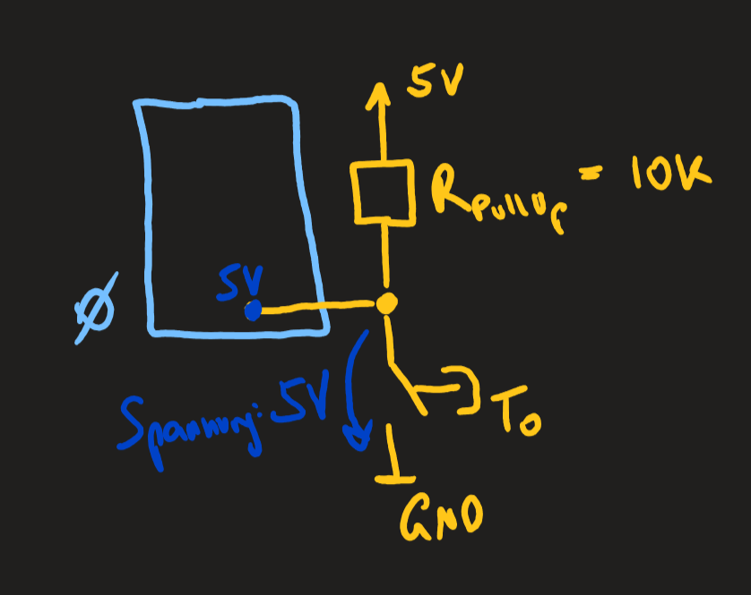
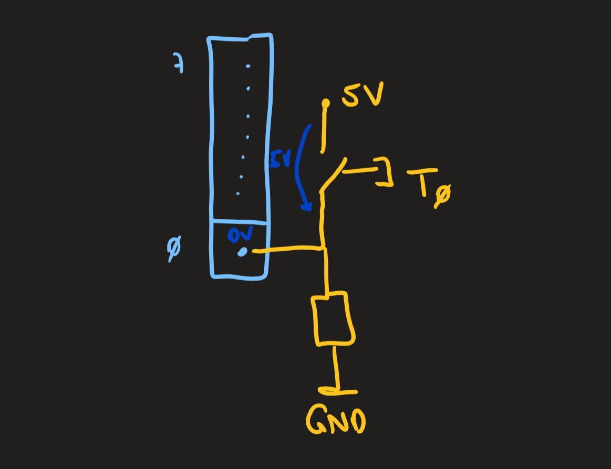

Buttons are an input of the user on the simplest hardware level. The button can either be pressed or not. This binary state option allows easy conversion to "power on" or "power off".

## Theory

Basically, there are two different ways to use buttons:

-   Active Low wiring => pull-up resistor
-   Active High circuit => Pull-Down resistor

These two types must be processed differently at [code level](#code).

### Active Low / Pull-Up

With the active low circuit, 5V voltage (active) is applied to the input when the button is pressed (low). The [structure](#active-low--pull-up-1) of an active low circuit uses the pull-up resistor.

### Active High / Pull-Down

Active High circuits work the other way round. Here, the 5V voltage (active) is applied to the input when the button is **not** pressed (high). The [structure](#active-high--pull-down-1) of an active high circuit uses the pull-down resistor.

## Structure

### Active Low / Pull-Up

A voltage divider is built on the corresponding PIN, which has a 10K resistor with 5V supply voltage on one side and a grounded button on the other side.


_A pull-up resistor build-up when the button is open_.


_A pull-up resistor build-up when the button is closed_.

### Active High / Pull-Down

A voltage divider is again connected to the corresponding PIN, but this time it has the ground (GRN) on the side of the 10K resistor and the button with 5V supply voltage on the other side.


_A pull-down resistor build-up when the button is open_.


_A pull-down resistor build-up when the button is closed_.

## Code

### without interrupts

:::note
Pay close attention to the differences in the if conditions!
:::

#### Pull-up circuitry

```c
#include <avr/io.h>
#include <util/delay.h>

void checkButton(void);

int main(void)
{
    // button to port B, pin 0
    // configure port B, pin 0 as input
	DDRB &= ~(1<<DDB0);

	while (1)
	{
		checkButton();
	}
}

void checkButton(void) {
    // Check whether the button is pressed.
	if (PINB & (1<<PINB0))
	{
		// Button was pressed 1x
	}

    // avoid bouncing
	_delay_ms(70);
}
```

#### Pull-down circuitry

```c
#include <avr/io.h>
#include <util/delay.h>

void checkButton(void);

int main(void)
{
    // button to port B, pin 0
    // configure port B, pin 0 as input
	DDRB &= ~(1<<DDB0);

	while (1)
	{
		checkButton();
	}
}

void checkButton(void) {
    // Check whether the button is pressed.
	if (!(PINB & (1<<PINB0)))
	{
		// Button was pressed 1x
	}

    // avoid bouncing
	_delay_ms(70);
}
```

#### Internal pull-up resistor

```c
#include <avr/io.h>
#include <util/delay.h>

void checkButton(void);

int main(void)
{
    // button to port B, pin 0
    // configure port B, pin 0 as input
	DDRB &= ~(1<<DDB0);

    // Port B, pin 0 voltage: 5V (activate internal pull-up resistor)
	PORTB |= (1<<PORTB0);

	while (1)
	{
		checkButton();
	}
}

void checkButton(void) {
    // Check whether the button is pressed.
	if (!(PINB & (1<<PINB0)))
	{
		// Button was pressed 1x
	}

    // avoid bouncing
	_delay_ms(70);
}
```

### With interrupts

With interrupts, you have the advantage of not having to constantly call a method in the while loop that queries the keys. This behaviour is explained even better in [interrupts](./interrupts.md).

#### Direct external interrupts

There are two PINs (2 and 3) on port D that have direct external interrupts functionality. This means that keys connected there can be specifically checked with the help of already defined interrupts. This saves a little complex programme code.

```c
#include <avr/io.h>
#include <util/delay.h>
#include <avr/interrupt.h>

int main(void)
{
    // key to port D, pin 2
    // configure port D, pin 2 as input
	DDRD &= ~(1<<DDD2);

    // Port D, pin 2 voltage: 5V (activate internal pull-up resistor)
	PORTD |= (1<<PORTD2);

    // interrupt
    // activate direct external interrupt at port D, pin 2
    EIMSK |= (1<<INT0);

    // set enable interrupt
    be();

	while (1)
	{
	}
}

ISR (INT0_vect) {
    // key was pressed 1x

    _delay_ms(70);
}
```

#### Group-based external interrupts

The group-based external interrupts always apply to the entire port. For this reason, the correct PIN must be checked again for keystrokes in the interrupt, as can be seen in the code below.

|       | Port B        | Port C         | Port D         |
| ----- | ------------- | -------------- | -------------- |
| PIN 0 | PCIE0, PCINT0 | PCIE1, PCINT8  | PCIE2, PCINT16 |
| PIN 1 | PCIE0, PCINT1 | PCIE1, PCINT9  | PCIE2, PCINT17 |
| PIN 2 | PCIE0, PCINT2 | PCIE1, PCINT10 | PCIE2, PCINT18 |
| PIN 3 | PCIE0, PCINT3 | PCIE1, PCINT11 | PCIE2, PCINT19 |
| PIN 4 | PCIE0, PCINT4 | PCIE1, PCINT12 | PCIE2, PCINT20 |
| PIN 5 | PCIE0, PCINT5 | PCIE1, PCINT13 | PCIE2, PCINT21 |
| PIN 6 | PCIE0, PCINT6 | PCIE1, PCINT14 | PCIE2, PCINT22 |
| PIN 7 | PCIE0, PCINT7 | PCIE1, PCINT15 | PCIE2, PCINT23 |

```c
#include <avr/io.h>
#include <util/delay.h>
#include <avr/interrupt.h>

int main(void)
{
    // key to port D, pin 4
    // configure port D, pin 4 as input
	DDRD &= ~(1<<DDD4);

    // Port D, pin 4 voltage: 5V (activate internal pull-up resistor)
	PORTD |= (1<<PORTD4);

    // interrupt
    // activate group-based external interrupt at port D, pin 4
    PCICR |= (1<<PCIE2);
	PCMSK2 |= (1<<PCINT20);

    // set enable interrupt
    be();

	while (1)
	{
	}
}

ISR (PCINT2_vect) {
    // necessary check of the specific PIN 4 on port D
    // due to the use of group-based interrupts.
	if(!(PIND & (1<<PIND4))){
        // key was pressed 1x
	}

    _delay_ms(70);
}
```

## Troubleshooting

### Floating Point

Without a resistor, you must not apply a 5V supply voltage to the button:


### Short circuit

Similarly, a voltage divider must not simply be connected to the ground (GND), as this ground would immediately cancel the supply voltage.


